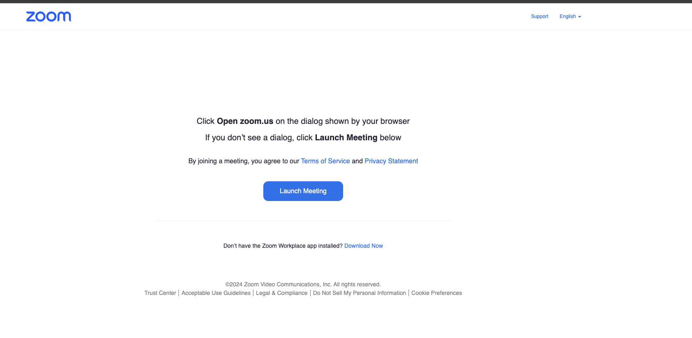

# web-rolls

Rickroll everyone, of course

This was my first HTML project.
I'll continue this on other websites soon.

Currently, the only functioning one is the zoom one!
check it out here:
[https://hack.club/f1hn3e](https://hack.club/f1hn3e)

Scroll down!!! \
\

Steps I took.
1. Inspect element
2. copy the code
3. Run the code,
4. Remove extra launcher scripts that duplicate things
5. find button elements that are promising 
